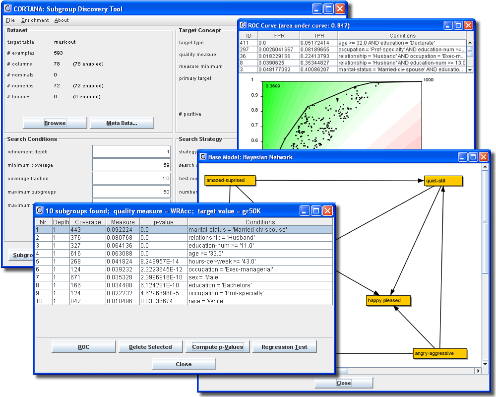

# SubDisc: Subgroup Discovery

SubDisc is a Data Mining tool for discovering local patterns in data. SubDisc features a generic Subgroup Discovery
algorithm that can be configured in many ways, in order to implement various forms of local pattern discovery. The tool
can deal with a range of data types, both for the input attributes as well as the target attributes, including nominal, 
numeric and binary. 

A unique feature of SubDisc is its ability to deal with a range of Subgroup Discovery settings, determined by the type
and number of target attributes. Where regular SD algorithms only consider a single target attribute, nominal or 
sometimes numeric, Cortana is able to deal with targets consisting of multiple attributes, in a setting called 
Exceptional Model Mining.

SubDisc was previously developed under the name Cortana.

## Features
* Generic parameterized Subgroup Discovery algorithm.
* Multiple data types supported.
* Implemented in Java, so works on all major platforms, including Windows, Linux and Mac OS.
* Works on propositional (tabular) data from flat files, .TXT or .ARFF.
* Includes Exceptional Model Mining settings.
* Statistical validation of mining results.
* Graphical presentation of results, such as ROC curves, scatter plots, and exceptional models.
* Additional bioinformatics module for literature-based gene set enrichment (see bioinformatics below).
* Free binary version and open-source access. 
* Wrapper available for R (https://github.com/SubDisc/rSubDisc) and Python (soon)

The code is compatible with Java 15. 

## To use

1. Either download the last released version jar file (https://github.com/SubDisc/SubDisc/releases/) or build it yourself (below).
2. Double-click on the .jar file or use java cli (ex.: `java -jar target/subdisc-gui.jar`).

The interface should appear, and you are ready to open a data file and discover subgroups!

## How to build
1. Clone the repository: `git clone https://github.com/SubDisc/SubDisc.git`
2. Use maven to assemble the .jar file: `mvn package`
3. The .jar file is created in `./target` and named something like `subdisc-gui-2.1094.jar`. 

## Scientific Publications
Technical details concerning the algorithms behind Cortana can be found in various scientific publications:

* [Subgroup Discovery in Ranked Data, with an Application to Gene Set Enrichment](http://www.kiminkii.com/publications/pl2010.pdf) </a>
* [Exceptional Model Mining](http://www.kiminkii.com/publications/PKDD2008.pdf)
* [Exploiting False Discoveries - Statistical Validation of Patterns and Quality Measures in Subgroup Discovery](http://www.kiminkii.com/publications/icdm2011.pdf)
* [Diverse Subgroup Set Discovery](http://www.springerlink.com/content/6xp2231102214153/?MUD=MP)
* [Flexible Enrichment with Cortana (Software Demo)](http://www.kiminkii.com/publications/benelearn2011a.pdf)
* [Efficient Algorithms for Finding Richer Subgroup Descriptions in Numeric and Nominal Data](http://www.kiminkii.com/publications/icdm2012.pdf)
* [Non-Redundant Subgroup Discovery in Large and Complex Data](http://www.kiminkii.com/publications/ecmlpkdd2011.pdf)
* [Subgroup Discovery meets Bayesian networks: an Exceptional Model Mining approach](http://www.kiminkii.com/publications/icdm2010.pdf)
* [Discovering Local Subgroups, with an Application to Fraud Detection](http://www.kiminkii.com/publications/pakdd2013.pdf)
* [A Bayesian Scoring Technique for Mining Predictive and Non-Spurious Rules](http://people.cs.pitt.edu/~iyad/papers/PKDD_2012.pdf)

## Contributors
The following people have contributed in various ways to the development of SubDisc/Cortana:

* [Arno Knobbe](http://www.liacs.nl/~knobbe)
* [Marvin Meeng](http://www.liacs.nl/~meeng)
* [Wouter Duivesteijn](http://www.liacs.nl/~wouterd)
* [atthijs van Leeuwen](http://www.patternsthatmatter.org/)
* [Rob Konijn](http://www.cs.vu.nl/en/research/artificial-intelligence/ci/phd-students/konijn/index.asp)
* [Michael Mampaey](http://www.michaelmampaey.com/)
* [Siegfried Nijssen](http://http://www.kuleuven.be/wieiswie/en/person/u0052873/)
* [Iyad Batal](http://people.cs.pitt.edu/~iyad/)
* Jeremie Gobeil

